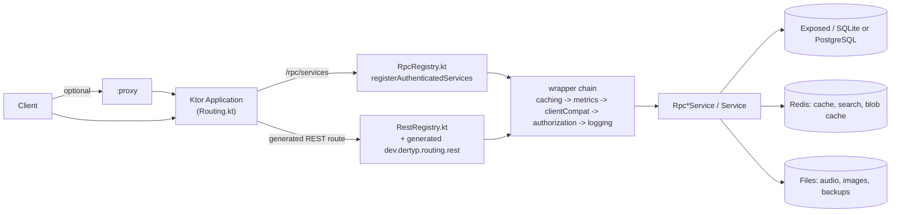

# Architecture

How the Synara server is put together: modules, request flow, package layout, and where background work and generated code fit in. For building a client against the server, start at [docs/README.md](README.md) instead.

## Modules

| Module | Role |
|---|---|
| `:server` | The Ktor application: RPC/REST routing, services, database access, workers. |
| `:common-rpc` | Multiplatform module shared with client apps: RPC interfaces, data models, doc annotations (`@RpcDoc`, `@RestGet`, ...). Git submodule, see [Common-rpc submodule](DEVELOPMENT.md#common-rpc-submodule-workflow). |
| `:common-rpc:compiler` | KSP processor that generates the client-side service registry from the `common-rpc` interfaces. |
| `:common-rpc:doc-compiler` | KSP processor that reads the doc annotations and writes [RPC_SERVICES.md](RPC_SERVICES.md) and [MODELS.md](MODELS.md). |
| `:common-rpc:rest-compiler` | KSP processor that generates the REST route registration functions (`register<Service>Rest`) into `dev.dertyp.routing.rest` during `:server:kspKotlin`, and writes [REST_API.md](REST_API.md). |
| `:proxy` + `:common-proxy` | Standalone reverse proxy in front of one or more Synara servers; see `docker-compose.proxy.yml` and `Dockerfile.proxy`. |
| `:listen-backup` + `:common-listen-backup` | Standalone receiver that stores a copy of listening history; see [LISTEN_BACKUP.md](LISTEN_BACKUP.md). |
| `:plugin-api` | Interfaces (`ISynaraPlugin`, `IImporter`, ...) third-party plugins implement; see [PLUGINS.md](PLUGINS.md). |
| `:mock-server` | Generates RPC and REST endpoints with dummy data for client development; see [MOCK_SERVER.md](MOCK_SERVER.md). |

Three Python sidecars run alongside the server (see `docker-compose.yml`): `transcriber/` (WhisperX-based lyrics/vocal transcription and alignment), `audio-embed/` (Essentia MusiCNN audio embeddings for recommendations) and `recsys/` (Word2Vec/K-Means-based recommendation model training). Each is a small FastAPI/script service with its own `Dockerfile` and is reached over HTTP from the corresponding server service (`MetadataFetchingService`/timecode tagging, `AudioEmbeddingService`, `RecommendationService`).

## Request flow

Both `/rpc/services` (kRPC over CBOR, see `Routing.kt`) and the generated REST routes reach the same service instances and go through the same wrapper chain, so behavior (caching, metrics, client compatibility, authorization, logging) is identical regardless of transport. `/rpc` and `/rpc/auth` (`registerPublicServices` in `routing/RpcRegistry.kt`) are unauthenticated: stats, auth/login, and the handshake. Their REST counterpart, `registerPublicRestServices` (`routing/RestRegistry.kt`), is mounted inside an optional `synara-auth` scope (`authenticate("synara-auth", optional = true) { ... }` in `Routing.kt`): a bearer token is honoured when present, but only functions annotated `@RestPublic` (for example the image/cover-data endpoints) work without one — the rest of that block still requires a user to resolve. Everything under `jwtService.authenticated { ... }` (`registerAuthenticatedServices`/`registerAuthenticatedRestServices`) requires a valid JWT.

### Wrapper chain

Each authenticated service instance is wrapped, outermost first: `withCaching` (`utils/Caching.kt`, `@Cached` annotation) → `withMetrics` (`utils/Metrics.kt`, records to `RpcMetricsCollector` when enabled) → `withClientCompat` (`utils/ClientCompat.kt`, reshapes responses per `CompatRule` in `utils/CompatRule.kt` based on the client's declared feature support) → `withAuthorization` (`utils/Authorization.kt`, enforces `@RequiresCapability`/`@RequiresAdmin` from `common-rpc`) → `withLogging` (`utils/Logging.kt`). All five are Java dynamic proxies over the service interface; read `RpcRegistry.wrap` for the exact composition.

## Package layout (`server/src/main/kotlin/dev/dertyp/`)

| Package | Contents |
|---|---|
| `core/` | Cross-cutting helpers: `ClientInfo`, `ContentSniffer` (magic-byte image/video sniffing), `CustomMigration` base, HTTP/file/path utilities, resource objects. |
| `services/` | Business logic, one `Service` (or `Rpc*Service`) per domain. Subpackages: `audio/`, `cover/`, `gamdl/`, `hue/`, `import/`, `intake/`, `jobs/`, `metadata/`, `podcast/`, `recommendation/`, `release/`, `schedule/` (workers), `soundcloud/`, `subsonic/`, `sync/`, `ui/`, `youtube/`. |
| `routing/` | `RpcRegistry.kt`, `RestRegistry.kt`, `rest/` (`RestCall`, `RestConvert`, `RestDefaults`, `RestFileProvider`, `RestRouteInfo` — support code the generated `register*Rest` functions build on), plus `RadioRoutes.kt`, `McpRoutes.kt`, `Mirror.kt`. |
| `db/` | Exposed `Table` objects, one file per table, plus `db/migrations/` (Flyway Kotlin migrations, `V1_x__Name.kt`) and `CustomMigrationTable.kt`. |
| `migrations/custom/` | One-off data migrations (`@Migration("3.x")` classes extending `CustomMigration`), run by `services/CustomMigrationService.kt` after Flyway. |
| `mcp/` | The read-only Model Context Protocol server, see [MCP.md](MCP.md). |
| `plugins/` | `PluginManager` (loads jars from `plugins/`), `JmDNSPlugin` (mDNS advertisement), `RedisCacheProvider`. |
| `serializers/` | Custom Gson type adapters (`OffsetDateTime`, `LocalDate`, `Duration`, ISO-8859-1 `ByteArray`) for the Gson instance `RedisCacheProvider` uses to serialize cached RPC/REST responses into Redis. |
| `utils/` | The wrapper chain, `CompatRule`s, and small helpers (`Barcodes`, `ColorUtils`, `HueColor`, `ImageUtils`, `UiSchemaCompat`). |
| `audio/` | Audio processing (e.g. `AtmosProcessor`). |

`Application.kt` is the Ktor entry point: it installs Koin (`mainModule`, defined there, plus `pluginModule`), registers every `Service` as a Koin `single`, auto-registers every `@WorkerTask`-annotated class as a `Worker` via a `ClassGraph` scan of `dev.dertyp.services.schedule`, runs `DatabaseManager.init()` and `CustomMigrationService.runMigrations()`, then calls `configureHTTP()`, `configureRouting()` and `configureServices()` (`HTTP.kt`, `Routing.kt`, `Services.kt`).

## Dependency injection and service lifecycle

Services are plain classes extending `services/Service.kt` (`startService`/`stopService`, both no-ops by default) registered as Koin singletons in `Application.mainModule`. `Services.kt` (`configureServices`) launches `startService()` for the handful of services that run continuous background work (importer, search index worker, storage, cover generation/auto-trigger, Hue, plugin manager); most services are otherwise just called synchronously from RPC/REST handlers.

## Workers and task logs

Recurring jobs are `Worker` subclasses (`services/schedule/Worker.kt`) annotated with `@WorkerTask(key, name)` (`services/schedule/WorkerTask.kt`); keys are mirrored in `common-rpc`'s `data/TaskKeys.kt`. `Worker.run` guards against overlapping runs, logs start/finish, and dynamically shares CPU threads across concurrently active workers (`runParallel`, thread grants scaled by `workers.threadMultiplier`). `ScheduledTaskConfigurationService` holds each task's schedule (cron or "after another task") and seeds `DEFAULTS` on startup; `ScheduleService` triggers workers on schedule; `ScheduledTaskLogService` records each run's progress and result for the admin UI. New periodic work should always be a `@WorkerTask`, never an ad hoc loop.

## Migrations

Schema changes are Flyway Kotlin migrations in `db/migrations/` (`V1_x__Name.kt`), run by `DatabaseManager.setupDatabase()` on every startup. Data backfills and one-off cleanups that need Kotlin logic instead of SQL are `migrations/custom/` classes annotated `@Migration("3.x")`, extending `CustomMigration`; `CustomMigrationService.runMigrations()` discovers, sorts by version, and runs the ones not yet recorded in `CustomMigrationTable`, after Flyway has run.

## Images

`services/ImageService.kt` stores cover art and generates blurhashes (`io.trbl.blurhash`) and thumbnails (Thumbnailator) on demand, with an optional Redis-backed blob cache (`RedisCacheProvider.Config`, `redis.cacheAnimatedImages` for animated covers) in front of the on-disk store. `core/ContentSniffer.kt` checks magic bytes so a failed fetch (e.g. a 404 page) is never cached or served as an image.

## Search and Redis

Redis is optional (`redis.host`); when configured it backs the RPC/REST response `SimpleCache` (`HTTP.kt`), the image blob cache, and `RedisSearchService`, which builds RediSearch indices (song/artist/... ) for ranked search when `redis.useSearch` is enabled. Without Redis, caching falls back to an in-memory cache and search falls back to database queries.

## Generators

These tasks generate checked-in files from source; never hand-edit their output. `./gradlew generateDocs` runs all of them:

| Output | Generated by |
|---|---|
| [RPC_SERVICES.md](RPC_SERVICES.md), [MODELS.md](MODELS.md), [PERMISSIONS.md](PERMISSIONS.md) | `:common-rpc:kspCommonMainKotlinMetadata` (the `doc-compiler` KSP processor) |
| [REST_API.md](REST_API.md), plus the `register*Rest` functions used by `RestRegistry.kt` | `:server:kspKotlin` (the `rest-compiler` KSP processor) |
| [API_CONSTANTS.md](API_CONSTANTS.md) | `:server:generateApiConstantsDocs` |
| [ENVIRONMENT_VARIABLES.md](ENVIRONMENT_VARIABLES.md), `example.env` | root `generateEnvDocs` task |

See [DEVELOPMENT.md](DEVELOPMENT.md) for when each one runs and how to regenerate them.

## Plugins

`plugins/PluginManager` loads jars from a `plugins/` directory and initializes each `ISynaraPlugin`, giving it a `PluginContext` to register importers, indexers, scheduled tasks, API-key scopes, server-driven UI, translations, intake handlers and jobs without touching server source. See [PLUGINS.md](PLUGINS.md) for the interface and capability marker interfaces.
